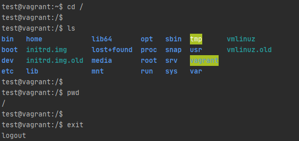

# 1. SimpleConnect함수
* ssh 서버 접속
* 표준 입력, 출력 사용

 

# 2. redirectConnect함수
* pipestream사용하여 입력,출력

# 참고자료 
* [1] https://jimolonely.github.io/2019/03/14/java/034-jsch-interactive-shell-stream-redirect/